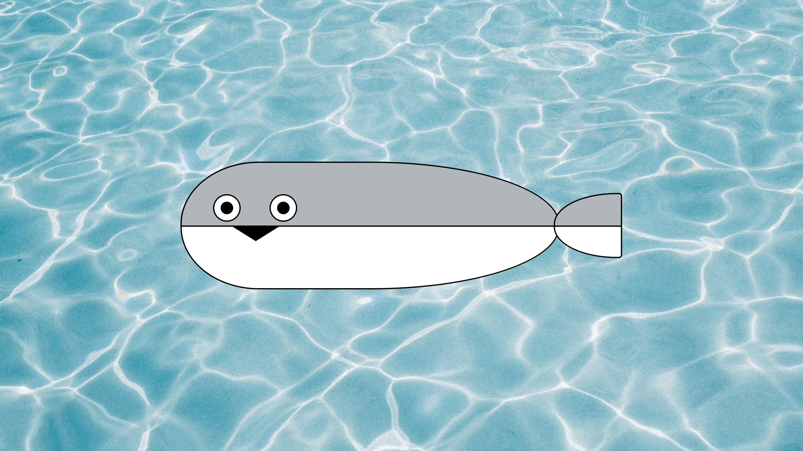

# 萨卡班甲鱼！

在这个题目中，你需要用 CSS 画一个萨卡班甲鱼，效果如下图：

除了学习 CSS 之外，你可能需要阅读以下 MDN 文档来了解更多关于边框和圆角的知识：

- https://developer.mozilla.org/zh-CN/docs/Web/CSS/border
- https://developer.mozilla.org/zh-CN/docs/Web/CSS/border-radius

学会读 MDN 也是很重要的能力哦~

## 要求

实现如上图所示的萨卡班甲鱼

- 颜色自定，相近即可
- 萨卡班甲鱼整体大小与位置自定，显示正常不溢出即可
- 鱼身与鱼尾圆角半径自定，相近即可，请注意实现鱼身和鱼尾左右不对称的圆角效果

## 参考知识点

- [CSS 盒模型](https://developer.mozilla.org/zh-CN/docs/Learn/CSS/Building_blocks/The_box_model)
- [CSS 定位](https://developer.mozilla.org/zh-CN/docs/Web/CSS/position)
- [CSS 边框](https://developer.mozilla.org/zh-CN/docs/Web/CSS/border)
- [CSS 边框半径](https://developer.mozilla.org/zh-CN/docs/Web/CSS/border-radius)
- [CSS 伪元素](https://developer.mozilla.org/zh-CN/docs/Web/CSS/Pseudo-elements)

每个知识点的链接都指向了 MDN 中文文档，你可以点击链接查看详细的解释和示例。

## 评分标准

1. 与示例实现几乎无差异：10
2. 与示例实现存在一定差异，但不影响观感：7 - 9
3. 存在明显视觉效果缺失：4 - 6
4. 大面积视觉效果缺失：0 - 3
