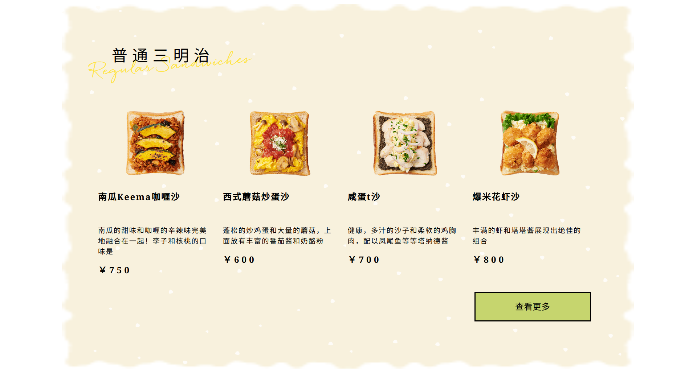

# 三明治

请按照示例图片效果，实现页面

### 补充说明

- 请不要修改 body 结构
- 主体内容需要居中对齐
- 包含 3 张背景图，请参照示例图片将其置于合适的位置
- 需保证在 1280x800 viewport 下显示不溢出

## 评分标准

1. 与示例实现几乎无差异：10
2. 与示例实现存在一定差异，但不影响观感：7 - 9
3. 存在明显视觉效果缺失/错误：4 - 6
4. 大面积视觉效果缺失/错误：0 - 3

## 知识点

- CSS 背景
- CSS 字体
- CSS 盒子模型
- CSS 外内边距
- CSS 定位
